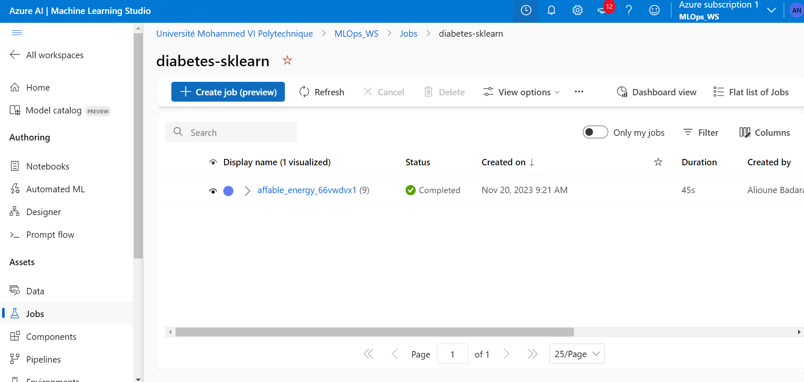
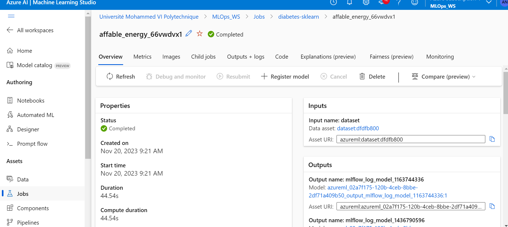
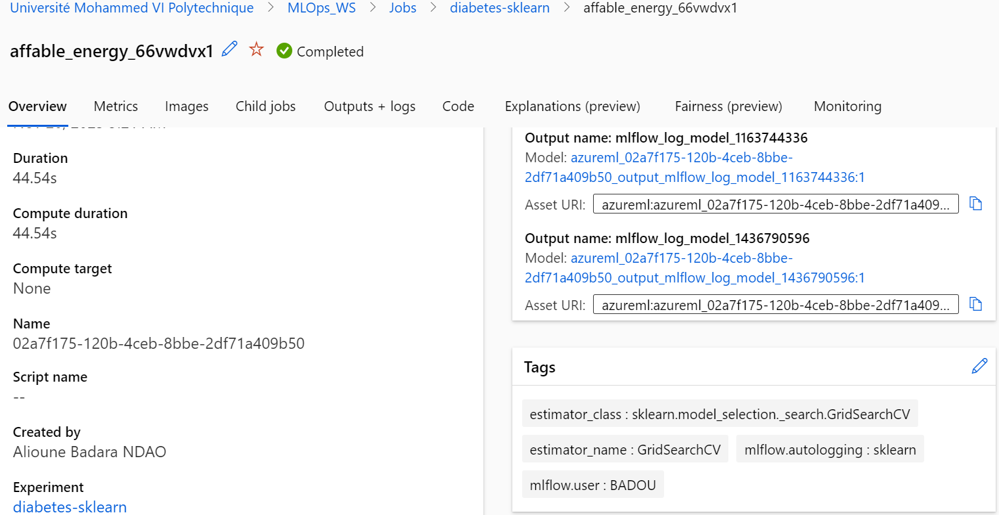
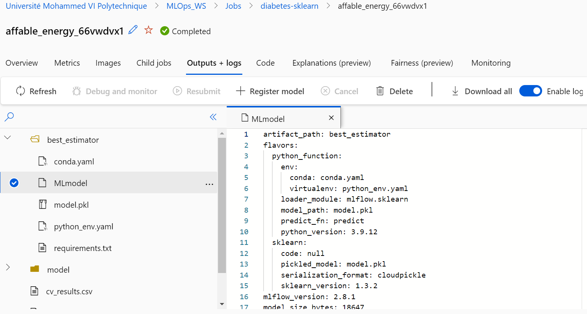
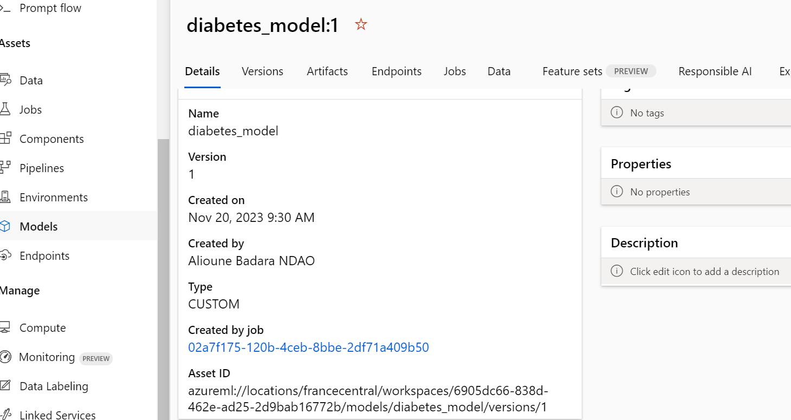
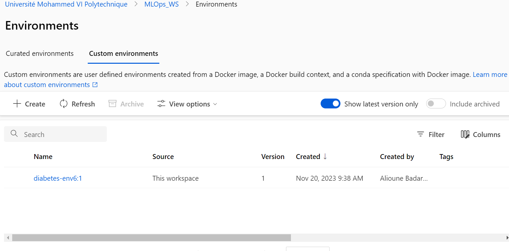

# Atelier_microservices

# Overview
Un atelier portant sur comment déployer un modèle ML sur ACI en utilisant azure ML et
MLflow 
Dans le dossier « Azure MLflow Deploy », on a suivi les étapes décrites dans le fichier jupyter

### Screen application
Voici quelques screens de notre modèles déployé sur ACI en utilisant azure ML et
MLflow 

  

  

  

  

  

  

